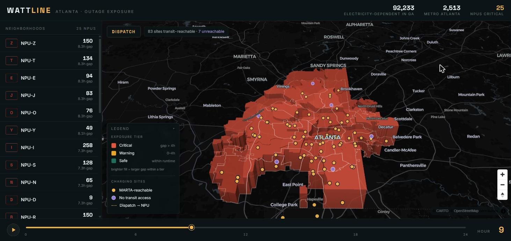

<!-- ╔══════════════════════════════════════════════════════════════════╗ -->
<!-- ║                         VINH LE · README                         ║ -->
<!-- ║    Full-stack & AI SWE · Georgia Tech OMSCS · Hackathon Builder  ║ -->
<!-- ╚══════════════════════════════════════════════════════════════════╝ -->
<!-- Palette (Ember): bg 0D0D0F · surface 1A1A1F · orange FF6B35 · amber FFB347 · red E63946 · text F5F5F5 -->
<!-- Generated assets (stats.svg, pokegrid.svg) come from .github/workflows/profile.yml → output branch -->

<!-- ─────────────────────────  HERO BANNER  ───────────────────────── -->

  

  
  
  

 

<!-- ───────────────────────────  01 ABOUT  ─────────────────────────── -->

I'm Vinh, a full-stack and AI engineer in Atlanta. I'm happiest when I'm building, and the projects I care about most all started the same way: a real problem — a family searching for someone, a neighborhood that goes dark, a racer who needs a coach in their ear — and the question of what AI could actually do about it. I finished my B.S. in CS at Georgia State (Dean's List) and started the M.S. at Georgia Tech in August 2026. Before that I co-led a team at SkyIT modernizing a multi-tenant Django/React platform, and spent the summer as a CodePath Technical Fellow for a 200+ learner AI engineering course.

<table align="center" width="100%">
  <tr>
    <td valign="top" width="50%">
      <b>Now</b> 
      
      · M.S. CS @ Georgia Tech (OMSCS) 
      · Shipping <a href="https://github.com/vinhbin/wattline">WATTLINE</a> past the hackathon build 
      · Local, on-device agents (<a href="https://github.com/StephenSook/bearing-witness">Bearing Witness</a>)
      
    </td>
    <td valign="top" width="50%">
      <b>Next</b> 
      
      · Agentic systems with a human in the loop 
      · Multi-vector retrieval beyond forensics 
      · Founding something in AI for high-stakes domains
      
    </td>
  </tr>
</table>

 

<!-- ─────────────────────────  02 FEATURED BUILDS  ─────────────────── -->

  <b>Hackathon record</b> &nbsp;·&nbsp; 🥇 1st @ Actian VectorAI DB Build Challenge &nbsp;·&nbsp; 🏆 Best Hack for Good @ Hack RenderATL / MLH &nbsp;·&nbsp; ⚙️ Dell × NVIDIA AI Hackathon NYC &nbsp;·&nbsp; 🏎️ IBM SkillsBuild AI Builders &nbsp;·&nbsp; 🗺️ Team USA × Google Cloud &nbsp;·&nbsp; 🛡️ Reddit Mod Tools

<!-- flagship -->

<table align="center" width="100%">
  <tr>
    <td valign="top">
      🏆 <a href="https://github.com/vinhbin/wattline"><b>WATTLINE</b></a> &nbsp;Best Hack for Good · Hack RenderATL / MLH · Aug 2026 
      When the power goes out, some people are on a clock. WATTLINE maps electricity-dependent medical equipment users to neighborhood-level outage exposure across 25 Atlanta NPUs, then routes charging capacity to the highest-gap areas, constrained by MARTA reachability. I led the 4-person team: scoped the project, verified the federal HHS emPOWER pipeline against a 92,233-person state anchor, and built the React/MapLibre frontend with a 24-hour timeline scrubber. Read path is precomputed JSON behind FastAPI, no database per request. 
      Python · FastAPI · React · MapLibre · HHS emPOWER &nbsp;·&nbsp; <a href="https://wattline-web.onrender.com">Live demo</a> · <a href="https://devpost.com/software/wattline">Devpost</a>
    </td>
  </tr>
</table>

<table align="center" width="100%">
  <tr>
    <td valign="top" width="33%">
      🥇 <a href="https://github.com/StephenSook/trace-forensic-search"><b>Trace</b></a> 
      1st Place · Actian VectorAI DB Build Challenge 
      AI forensic search matching missing-person descriptions to unidentified remains. Multi-vector retrieval (SapBERT, BGE-M3, CLIP) fused with Reciprocal Rank Fusion. 
      Python · FastAPI · React · Actian VectorAI 
      <a href="https://trace-forensic-search-ssookra-7703s-projects.vercel.app/">Demo</a> · <a href="https://dorahacks.io/buidl/43227">DoraHacks</a>
    </td>
    <td valign="top" width="33%">
      ⚙️ <a href="https://github.com/StephenSook/bearing-witness"><b>Bearing Witness</b></a> 
      Dell × NVIDIA AI Hackathon · NYC 
      Always-on, fully local bearing-screening agent on the Dell Pro Max GB10. Physics does the diagnosis, a local model files the paperwork, a human has to say yes. 
      Python · Local LLM · Signal processing · GB10
    </td>
    <td valign="top" width="33%">
      🏎️ <a href="https://github.com/StephenSook/apex"><b>APEX</b></a> 
      IBM SkillsBuild AI Builders Challenge 
      AI race engineer coaching adaptive racers on IBM Granite. Owned the backend: 20 live endpoints, Granite tool integration, 192-test suite gating every merge. 
      Python · FastAPI · IBM Granite · pytest · CI 
      <a href="https://apex-one-black.vercel.app">Demo</a>
    </td>
  </tr>
  <tr>
    <td valign="top" width="33%">
      🗺️ <a href="https://github.com/StephenSook/Hometown-Pathway-Atlas"><b>Hometown Pathway Atlas</b></a> 
      Team USA × Google Cloud Hackathon 
      County-level Olympic and Paralympic parity analytics. Data pipeline with per-capita normalization and empirical-Bayes shrinkage; Vertex AI Gemini on Cloud Run. 
      Python · Vertex AI Gemini · Cloud Run 
      <a href="https://atlas-frontend-635524063449.us-central1.run.app">Demo</a>
    </td>
    <td valign="top" width="33%">
      🛡️ <a href="https://github.com/StephenSook/context-mod-devvit"><b>ContextMod</b></a> 
      Reddit Mod Tools Hackathon 
      Rule-engine backend for a native Devvit moderation bot: JSON5 rules, multiple rule kinds and action handlers, strict TypeScript, fully tested. 
      TypeScript · Devvit · JSON5 
      <a href="https://developers.reddit.com/apps/cm-devvit">App</a>
    </td>
    <td valign="top" width="33%">
      🎮 <a href="https://github.com/vinhbin/Marvel-Rivals-Live-Coach"><b>Rivals Coach</b></a> 
      Side project 
      Live coaching companion for Marvel Rivals: reads the match roster via Overwolf GEP and suggests one pick / swap / hold from your own comfort pool. Decision support, not a stats tracker. 
      TypeScript · Overwolf
    </td>
  </tr>
</table>

More on <a href="https://devpost.com/vinhbin">Devpost</a> &nbsp;·&nbsp; <a href="https://vinh-le.com">vinh-le.com</a>

 

<!-- ─────────────────────────  03 HOW I WORK  ──────────────────────── -->

<table align="center" width="100%">
  <tr>
    <td valign="top" width="33%">
      <b>Tests gate the merge</b> 
      APEX shipped with a 192-test backend suite wired into CI before the demo, not after. If it isn't tested, it isn't done.
    </td>
    <td valign="top" width="33%">
      <b>Precompute the read path</b> 
      WATTLINE serves frozen JSON; nothing calculates per request. Boring at runtime is a feature.
    </td>
    <td valign="top" width="33%">
      <b>A human says yes</b> 
      Bearing Witness drafts the inspection; it never files it. AI proposes, a person decides, especially when the stakes are real.
    </td>
  </tr>
</table>

 

<!-- ─────────────────────────  04 STACK  ───────────────────────────── -->

<table align="center" width="100%">
<tr><td align="right" width="120"><b>LANGUAGES</b></td><td>

</td></tr>
<tr><td align="right"><b>AI / ML</b></td><td>

</td></tr>
<tr><td align="right"><b>BACKEND</b></td><td>

</td></tr>
<tr><td align="right"><b>FRONTEND</b></td><td>

</td></tr>
<tr><td align="right"><b>DATA</b></td><td>

</td></tr>
<tr><td align="right"><b>CLOUD / TOOLS</b></td><td>

</td></tr>
</table>

 

<!-- ─────────────────────────  05 ACTIVITY  ────────────────────────── -->

  

 

  
   Every contribution is a catch. Regenerated daily.

 

<!-- ─────────────────────────  06 CONNECT  ─────────────────────────── -->

  
  
  
  

 

  
    <b>Credit</b>: Layout inspired by <a href="https://github.com/StephenSook"><b>@StephenSook</b></a> · <a href="https://github.com/tylinndd"><b>@tylinndd</b></a> · <a href="https://github.com/1010nishant"><b>@1010nishant</b></a> 
    Built by <a href="https://github.com/vinhbin"><b>Vinh Le</b></a> · Atlanta, GA 
    Last edited: August 2026
  

